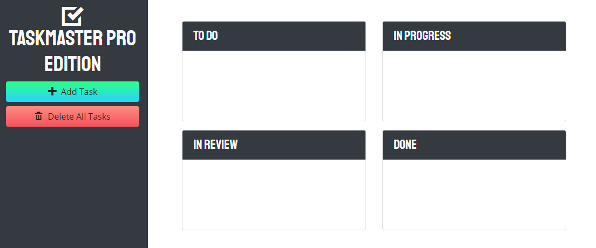

# Taskmaster-Pro

A mobile friendly task-management application with a nice Ui with drag and drop features to move tasks between 4 different statuses. Additionally the audit feature make sure that your tasks will never go unattended by changing the color of the task (overdue, imminent) and keep updating that using the browser native timer.

## Purpose

* Used ```jQuery methods``` to manipulate the DOM.

* Used jQuery methods to attach delegated browser events to elements.

* Improved the user experience with ```focus and blur events```. 

* Created ```responsive``` layouts using Bootstrap's ```grid``` system.

* Used the UI components Bootstrap provides.

* Leveraged ```Bootstrap's utility classes``` to avoid creating unnecessary custom CSS.

* Used jQuery extensions to enable ```draggable``` elements.

* Used ```jQuery UI```'s ```Datepicker``` widget with date-input form fields.

* Used ```Moment.js``` to handle JavaScript date and time functionality.

* Used JavaScript ```timer``` functions to schedule/automate logic.

* Used ```google``` font library to implement custom fonts.

* Used ```iconic``` icon library to implement font icons.

* Override default Bootstrap styles using ```custom CSS```.

## Built with 🛠️

* JavaScript
* HTML
* CSS

## Website

https://thisaramallawaarachchige.github.io/taskmaster-pro/




## Contribution

Made with ❤️ by Thisara MA


